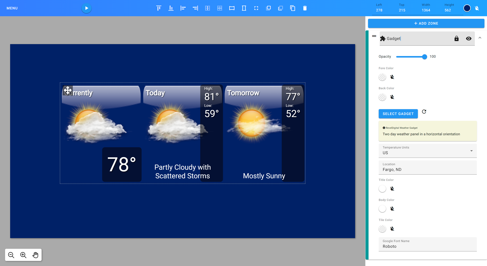
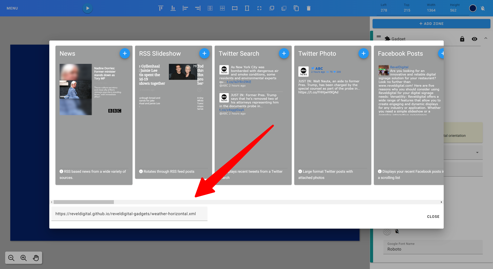

Revel Digital Gadgets
=====================

#Introduction

Gadgets are a simple means of providing customizable, dynamic content to any template. The Revel Digital platform includes a number of ready-to-use
gadgets for everything from weather conditions to social media feeds. Creating your own gadget is simple if you have some basic understanding of HTML
and Javascript.



# What's in a gadget

A gadget is nothing more than an XML file which defines the properties of the gadget along with the HTML and Javascript for rendering the gadget content.

Here's a template for a sample gadget:

```xml
<?xml version="1.0" encoding="UTF-8" ?> 
<Module> 
<ModulePrefs title="Sample Gadget" description="" author="" background="transparent">
  <UserPref name="myStringPref" display_name="Example string preference" datatype="string" default_value="Hello World!" required="true" />
  <UserPref name="myEnumPref" display_name="Example enum preferences" datatype="enum" default_value="first">
    <EnumValue value="first" display_value="First" />
    <EnumValue value="second" display_value="Second" />
  </UserPref>
  <UserPref name="myStylePref" display_name="Example style preferences" datatype="style" default_value="font-family:Verdana;color:rgb(255, 255, 255);font-size:24px;text-align:left;" required="true" />
  <UserPref name="myBooleanPref" display_name="Example boolean preference" datatype="bool" default_value="true" />
  <UserPref name="myColorPref" display_name="color" datatype="color" default_value="#ff00ff" />
  
  <!-- The following preferences should not be modified -->
  <UserPref name="ForeColor" datatype="hidden" />
  <UserPref name="BackColor" datatype="hidden" />
  <UserPref name="rdW" display_name="Width" required="true" default_value="280" datatype="hidden" />
  <UserPref name="rdH" display_name="Height" required="true" default_value="190" datatype="hidden" />
  <UserPref name="rdKey" display_name="Device Registration Key" default_value="*|DEVICE.REGISTRATIONKEY|*" datatype="hidden" />
</ModulePrefs>
<Content type="html">
<![CDATA[

<style type="text/css">
  body *
  {
    line-height: 1.2em; 
    letter-spacing: 0; 
    word-spacing: normal;
  }

  body
  {
    background: transparent;
    width: __UP_rdW__px;
    height: __UP_rdH__px;
    overflow: hidden;
  }
  .my-style
  {
    __UP_myStylePref__;
  }
</style>

<!-- Preferences can be inlined in your HTML like so -->
<div class="my-style" id="container">__UP_myStringPref__</div> 

<script type="text/javascript">

  var prefs = new gadgets.Prefs();

  // This function is called after the gadget has been initialized.
  function onLoad() {
    
    <!-- Preferences can be accessed at runtime like so -->
    alert(prefs.getString('myStringPref'));
  }

  gadgets.util.registerOnLoadHandler(onLoad);
  
</script>

]]>
</Content>
</Module>
```

### Module prefs

You'll see in the sample gadget a section for module preferences called `<ModulePrefs>`. It's here that you'll define any customizable properties for your gadget.
A preference is defined with a `<UserPref>` element and can have any of the following data types:

  * `string` for simple string properties
  * `enum` for defining a list of selectable options
  * `bool` for a checkbox type property
  * `style` for defining a number of CSS type styles
  * `hidden` for providing properties to the gadget which are not visible to the template designer
  
These preferences are then available in the gadget content either by direct substitution:

```html
<!-- This will substitute the myStringPref property -->
<div class="my-style" id="container">__UP_myStringPref__</div>
```

or by utilizing the gadget Javascript API method to retrieve a property value:

```javascript
/* Preferences can be accessed at runtime like so */
alert(prefs.getString('myStringPref'));
```

### Module content

The `<Content>` section of the gadget is where your HTML/Javascript is contained. This is the visible portion of the gadget and can contain most any valid HTML markup.
It's recommended to include the following script for initializing the gadget:

```html
<script type="text/javascript">

  var prefs = new gadgets.Prefs();

  // This function is called after the gadget has been initialized.
  function onLoad() {
  }

  gadgets.util.registerOnLoadHandler(onLoad);
  
</script>
```

This ensures the properties will be accessible via the `prefs` object.

### Publishing your gadget

Once you have your gadget XML ready to go, you'll need to make it available to the Revel Digital template editor.
Most any web hosting provider will do, but we recommend [Github](https://pages.github.com/) for it's simplicity.

You can read more on [Github Pages here](https://pages.github.com/). This is a great option for simple hosting.

### Adding your gadget to a template

Now that your gadget is available on the web we can add it to your template.



Add a new **Gadget zone** to your template, in the gadget properties click the 'Select Gadget' button and paste the URL to your gadget XML in the Source field. Tap Enter to submit the new Gadget URL. The custom gadget properties will populate and you will be able to now preview your gadget within the template.

Now you can preview the template to see your work!

# Yeoman generator

Our Yeoman generator can scaffold a gadget template for you automatically.

First, install [Yeoman](http://yeoman.io) and [generator-reveldigital-gadget](https://github.com/RevelDigital/generator-reveldigital-gadget) using [npm](https://www.npmjs.com/)
(we assume you have pre-installed [node.js](https://nodejs.org/)).

```sh
npm install -g yo
npm install -g generator-reveldigital-gadget
```

Then generate your new gadget:

```sh
yo reveldigital-gadget
```

# Angular Based Gadgets  

[Angular](https://angular.io/) is a popular framework for developing web based applications. By developing your gadget in Angular you are provided a wide range custom components, development tools, internationalization tools, accessibility tools, and more.

Revel Digital provides a custom Angular schematic for quickly scaffolding your Angular app for use as a gadget. The schematic incorporates the [Revel Digital client library](https://github.com/RevelDigital/reveldigital-client-library) for interfacing with player devices. The schematic also provides a simplified method for publishing and hosting your gadget to [GitHub Pages](https://pages.github.com/).

## Quickstart

**New to Angular?** [Check out the Angular documentation](https://angular.io/guide/setup-local) for getting your environment configured for development.


### **Step 1.** GitHub Repository Creation (Optional)

**Not hosting your app on Github? Skip to step #2.**

Create a new repository on [GitHub.com](https://github.com/). For more information, see "[Creating a new repository](https://docs.github.com/en/repositories/creating-and-managing-repositories/creating-a-new-repository)."


Copy your remote repository URL


```sh
git remote add origin <REMOTE_URL>
# Sets the new remote
git remote -v
# Verifies the new remote URL
```

### **Step 2.** Create a new Angular app

From within your working folder, run the following Angular CLI command using the name of your app.

```sh
ng new my-app --directory ./
# Generates the boilerplate code for a new Angular app
```

### **Step 3.** Add the Revel Digital libaries

Run the Revel Digital angular schematic which will configure your app for use as a Revel Digital gadget.

```sh
ng add @reveldigital/player-client
# Run the Revel Digital Angular schematic
```

### **Step 4.** Build

The build script will generate the Angular app along with a the gadget XML definition file.

```sh
npm run build:gadget
# Run the gadget build script
```

### **Step 5.** Deploy

The app can be hosted using any number of hosting services, however the provided schematic includes a simplified option for publishing to [GitHub Pages](https://pages.github.com/).

Assuming your working folder is associated with your GitHub repository, simply run the following command to deploy the app to the `gh-pages` branch. The gadget app and associated XML file will be publicly visibile and available for use in your signage.

```sh
npm run deploy:gagdet
# Deploy to GitHub Pages
```

## Sample usage

The majority of the functionality is contained within the [PlayerClientService](https://reveldigital.github.io/reveldigital-client-library/injectables/PlayerClientService.html). The service and supporting library exposes the following functionality:

- Methods for obtaining player details such as device time, locale, etc
- Methods for interfacting with the player including sending commands and calling into player scripting
- Player lifecycle methods (ready/start/stop)
- Gadget property accessors such as user preferences
- Miscellaneous helpers such as the SafeStyle pipe

Simply inject this service in your Angular component constructor in order to access the player client interface.

```ts
  constructor(public client: PlayerClientService) {

    this.prefs = client.getPrefs();
    
    this.style = this.prefs.getString('myStylePref');
    
    this.client.onReady$.subscribe((val) => {
      console.log(val ? 'Ready' : 'Not ready');
    });

    this.client.onCommand$.subscribe((cmd) => {
      console.log(`onCommand: ${cmd.name}, ${cmd.arg}`);
    });

    this.client.onStart$.subscribe(() => {
      console.log("onStart");
    });

    this.client.onStop$.subscribe(() => {
      console.log("onStop");
    });
  }
```

## Gadget Definition & Preferences

The `assets/gadget.yaml` file is the definition file for your gadget, responsible for defining the basic properties and features of the gadget as presented to the user. These properties include the gadget name, description, support URL, and preferences. A sample `gadgets.yaml` file is included in your project after running the schematic.

Preferences are the primary method for providing customization options of your gadget. They allow signage designers to change and preview gadget properties at design time within the Revel Digital CMS.

The following is the sample `gadgets.yaml` included with the schematic:

```yaml
# Basic properties of the gadget must include the following:
#   title: Title of the gadget as it will appear in the Revel Digital CMS UX
#   title_url: Optional support URL for the gadget
#   description: Details of the gadget. Will appear within the Revel Digital CMS
#   author: Name of author or organization credited with developing the gadget
#   background: (Deprecated) should always be transparent for most gadgets
#
title: My Gadget
title_url: https://mysupporturl.org
description: Describe the purpose of your gadget here
author: My Organization
background: transparent

# Requirments enable certain features of the gadget. Available options include:
#   reveldigital (core Revel Digital features)
#   offline (Enable service worker caching for offline support)
#   webfont (Enable Google WebFonts for dynamic font loading)
#
requirements:
  - reveldigital
  - offline
  - webfont

# Locales are use for localization within the gadget definition (XML) itself.
#  Docs for using the Gadget API for i18n are available here: https://developers.google.com/gadgets/docs/i18n
#
# Angular applications should use the i18n support provided by the Angular framework:
#  https://angular.io/guide/i18n-overview
#
locales:
  - messages: https://reveldigital.github.io/reveldigital-gadgets/ALL_ALL.xml

  - lang: fr
    messages: https://reveldigital.github.io/reveldigital-gadgets/ALL_ALL.xml

# Preferences provide customization options for the gadget and are accessible at both design time and runtime.
#
# Propreties of a preference include:
#   name: Unique name or ID for the preference
#   display_name: Name as shown in the UX
#   datatype: string, enum, hidden, bool, style
#   default_value: Default value
#   required: Make this prefence mandatory, must have a value
#   depends: The visibility of this preference depends on other preferences. This requires the name
#     of the dependent preference along with a list of values. Condition types can include
#     any_of, all_of, none_of. Nested depends conditions are also possible.
#
prefs:
  - name: myStringPref
    display_name: Sample string preference
    datatype: string
    default_value: test string
    required: true

  - name: myBoolPref
    display_name: Sample boolean preference
    datatype: bool
    default_value: true
    required: true
    depends:
      - name: myEnumPref
        any_of:
          - fast
          
  - name: myStylePref
    display_name: Sample style preference
    datatype: style
    default_value: font-family:Verdana;color:rgb(255, 255, 255);font-size:18px;
    required: true

  - name: myEnumPref
    display_name: Sample enum preference
    datatype: enum
    default_value: fast
    required: true
    options:
      - value: fastest
        display_value: Fastest
      - value: fast
        display_value: Fast
      - value: medium
        display_value: Medium
```

This definition file results in the following user experience when designing your gadget in a template:


You will see the preferences exposed in the editor which can then be modified at design time.

Individual preferences are able to be accessed in your gadget code like so:

```ts
this.prefs = client.getPrefs();

this.prefs.getString('myStringPref');
this.prefs.getBool('myBoolPref');
this.prefs.getFloat('myFloatPref');
this.prefs.getInt('myIntPref');
```

## Angular Library Documentation

Library documentation is available here: https://reveldigital.github.io/reveldigital-client-library/

A sample Angular app is available in this repo under [projects/test-app](/projects/test-app).
