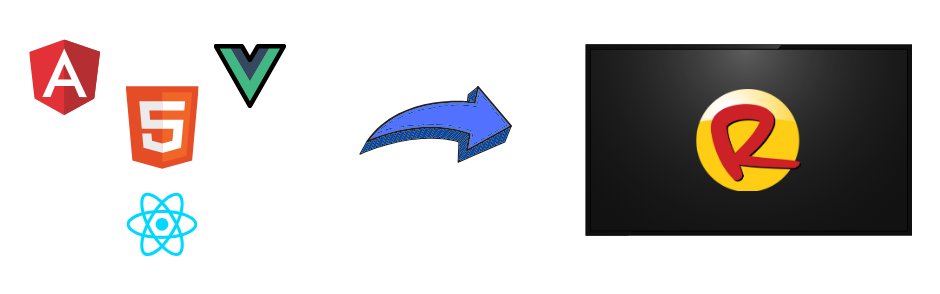
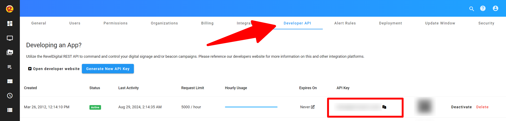
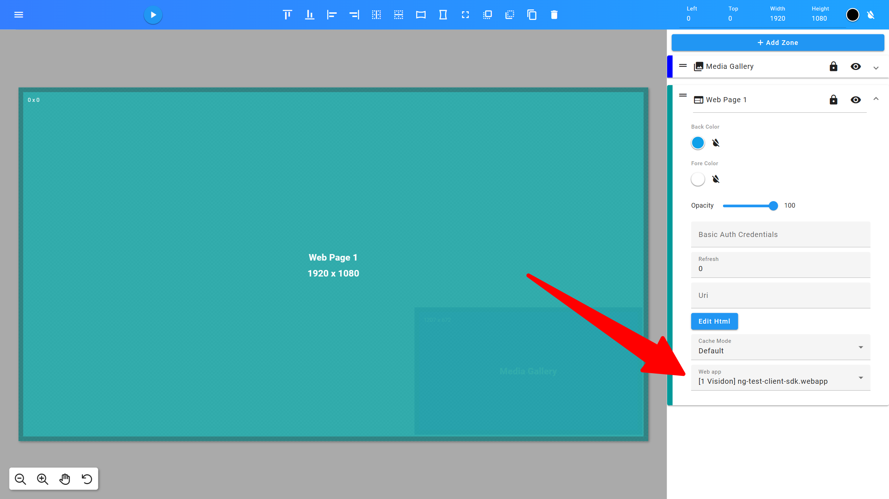

Revel Digital Webapps
=====================

#Introduction

Webapps are self-contained web applications which are able to be embedded within your digital signage content.
While there is some cross-over between Gadgets and Webapps, Webapps are generally preferred in situations where a more complicated UX is desired,
or when using existing development platforms and workflows.



# What's a Webapp?

A Webapp is simply a web application, or website, archived in ZIP format, and uploaded to the Revel Digital CMS as any other asset. Webapps have the following features:

* Developers are able to utilize any modern web framework including Angular, React, and Vue
* Webapps are able to be utilized in offline situtions where devices may have limited or no connectivity
* Able to interface with the underlying player application for performing native actions or to determine player specific details (location, tags, etc)
* GitHub Actions available for simplifying the development pipeline or integrating with existing Enterprise workflows

# The Webapp / Player Interface

Webapps (and Gadgets), are able to interface with the underlying player application for performing tasks such as event tracking, sending commands, executing script, or to
simply discover player specific details such as device name, location, tags, etc.

Revel Digital provides a Javascript library to simplify this interface and is compatible with most any modern Javascript runtime.
Library documentation is available here: [https://reveldigital.github.io/reveldigital-client-sdk/](https://reveldigital.github.io/reveldigital-client-sdk/)

# Deployment Options

In many cases the development team working on the digital signage UX will be completly independent of the team responsible for the digital signage network and deployment of assets.
As such, Revel Digital provides a number of options for deployment of your Webapp in order to streamline the process, reduce potential for mistakes, and to maintain this separation of concerns.

### GitHub Actions

A [GitHub Action](https://docs.github.com/en/actions) is used in automated CI/CD workflows for performing the build, packaging, and deployment of your Webapp. This, of course, assumes you are using GitHub as your code repository.
The [Revel Digital Webapp Action](https://github.com/marketplace/actions/revel-digital-webapp-deploy-action) performs the packaging and uploading of your Webapp to your Revel Digital account.
Tags are automatically applied to all newly uploaded Webapp assets including tags for version, environment, and any other custom tags you would like to apply.

Here's an example worflow utilizing our GitHub action for deployment of an Angular based app:
```yaml

name: Deploy Webapp
on: push

jobs:
  release-webapp:
    runs-on: ${{ matrix.os }}

    strategy:
      matrix:
        os: [ubuntu-latest]

    steps:
      - name: Check out Git repository
        uses: actions/checkout@v1

      - name: Install Node.js, NPM and Yarn
        uses: actions/setup-node@v1
        with:
          node-version: 22

      - name: install angular
        run: npm install -g @angular/cli@17

      - name: npm dependencies
        run: npm install

      - name: Build webapp
        run: ng build

      - name: Deploy webapp to Revel CMS
        uses: RevelDigital/webapp-action@v1.0.11
        with:
          api-key: ${{ secrets.Revel_API_Key }}
          environment: ${{ github.head_ref || github.ref_name }}
```

### Manual Deployment

If automation is not your thing, it's always possible to manually upload your Webapp asset direct to your Revel Digital account.

* Build your app using your framework build tools (eg: npm)
* Locate the build output folder (eg: /dist) where the index.html is located
* Archive (ZIP) this folder. Ensure index.html is at the root of the archive
* Rename the ZIP file to have an .webapp extension (eg: my-kiosk.webapp)
* Login to your Revel Digital account, navigate to Media, and upload the file


# Getting Started

The Revel Digital GitHub repo contains a number of examples for getting started. These are essentially skeleton projects in various frameworks with the
essentials pre-installed including the Player Client Javascript SDK and an example GitHub workflow.

We have the following examples available:

 - [Angular][1]
 - [React][2]
 - [Vue][3]

## Angular Example using Github Workflow

### **Step 1.** Fork the Angular example app

```sh
gh repo clone RevelDigital/ng-test-client-sdk
```

### **Step 2.** Install packages and build
To ensure your app builds locally, run the following NPM commands in your project folder.
```sh
npm i
npm run build
```

### **Step 3.** Generate an API key
In order to automate the deployment of your Webapp you'll need an API key from your Revel Digital acount. Login to your account and navigate to
**Account Information > Developer API**.

Generate a new API key and copy it's value.


### **Step 4.** Add a GitHub Secret
Your API key must be added to your GitHub repo as a secret. The key can then be utilized in a secure fashion by the GitHub Action.
[Please reference the GitHub documentation on adding a new repository secret](https://docs.github.com/en/actions/security-for-github-actions/security-guides/using-secrets-in-github-actions#creating-secrets-for-a-repository)

The repository secret must be named:
```sh
REVEL_API_KEY
```

### **Step 5.** Build and Deploy
With your repository setup, you can now build and deploy your app in one step.

Simply commit and push your changes to GitHub. The workflow will automate the process of building and deploying the app to your Revel Digital account.

### **Step 6.** Add your Webapp to a template
With your Webapp build and published, you can now assign it to a Web zone in any of your templates.


### **Step 7.** Done!
Your Webapp will now deploy to any scheduled devices.

[1]: https://github.com/RevelDigital/ng-test-client-sdk
[2]: https://github.com/RevelDigital/react-test-client-sdk
[3]: https://github.com/RevelDigital/vue-test-client-sdk
